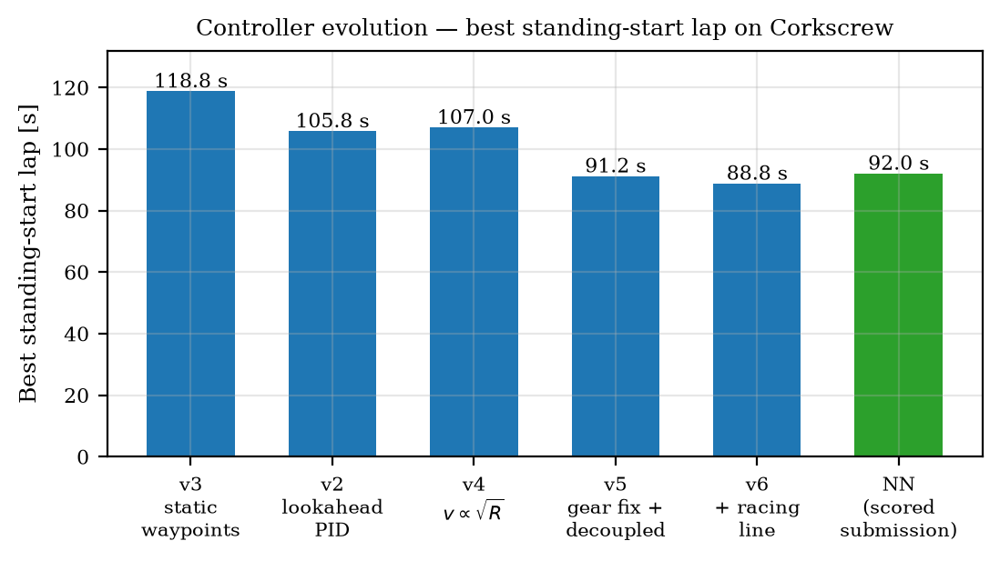
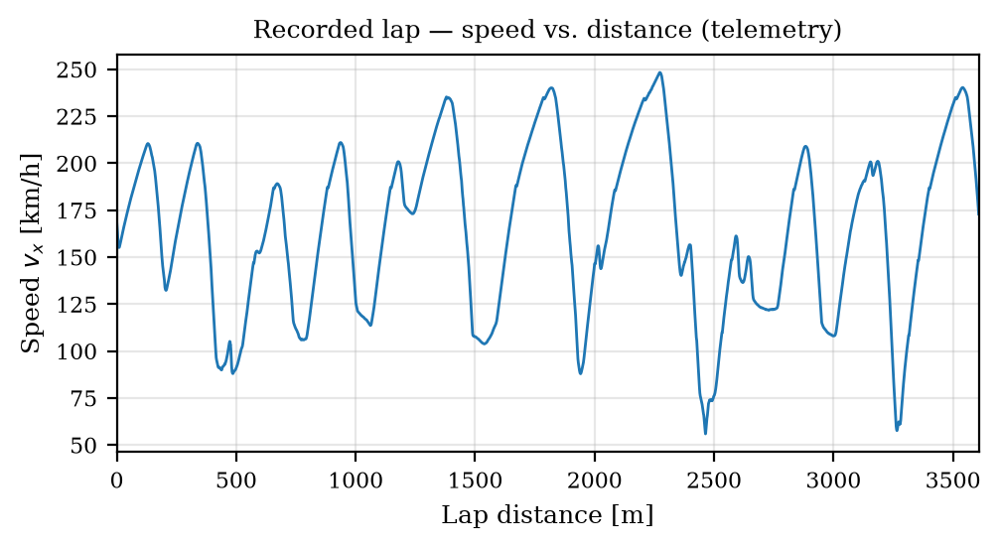
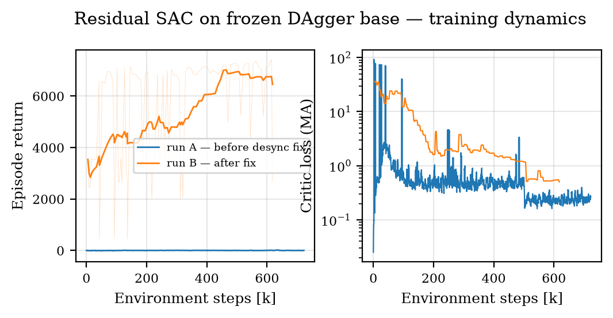

<<<<<<< HEAD
# S4-F — Neural Racing Agent for TORCS

**Team Overclocked · IBM AI Racing League · Politechnika Świętokrzyska**

A neural-network driver for the Corkscrew circuit (Laguna Seca, 3,602 m) in
[TORCS](http://torcs.sourceforge.net/) via the SCR (Simulated Car Racing) UDP
protocol at 50 Hz.

The deliverable — [`checkpoints/bc_v6.pth`](checkpoints/bc_v6.pth), a
**109k-parameter MLP (429 KB)** — scored a standing-start lap of

<div align="center">

## ⏱️ 92.04 s

*(scored standing-start lap — submission conditions: fuel + damage enabled, top speed 250 km/h)*

</div>



## How it works

The agent is produced by a **teacher–student pipeline** rather than pure
model-free RL: an analytic racing controller with 54 tunable parameters is
optimised by a distributed Optuna search (~15,000 headless-TORCS trials),
then distilled into the network via behavioural cloning and DAgger.
Soft Actor-Critic is used for from-scratch baselines and for optional
*residual* fine-tuning of the frozen distilled policy.

```
teacher_controller_v6 ──Optuna ×15k──▶ best params ──BC + DAgger──▶ bc_v6.pth
    (54 parameters,       (10 headless     (500k transitions,        (deliverable,
     analytic policy)      workers)         anti-copycat noise)       92.04 s)
                                                    │
                                     residual SAC (optional, frozen base)
```

The full story — including the five-bug residual-RL failure cascade, the
gearbox root-cause analysis that unlocked 70 km/h of top speed, and the
copycat pathology of behavioural cloning — is documented in:

- 📄 **[Case study (PDF)](docs/case_study.pdf)** — methodology, equations,
  experiments, results
- 📚 **[Technical documentation](docs/TECHNICAL_DOCUMENTATION.md)** — module
  reference, specs, pipelines, troubleshooting
- 📝 **[Experiment log](docs/EXPERIMENT_LOG.md)** — raw chronological
  engineering record



## Repository layout

```
├── config.py                 # single source of truth for ALL configuration
├── practice.xml              # race-config template (stays at root — see docs §14)
├── autostart_win.py          # Windows race auto-start (stays at root — see docs §14)
├── S4-F_requirements.txt     # pinned dependencies
├── core/                     # runtime: SCR client, env, observations, driver aids, submit agent
├── agents/                   # analytic teachers (v1–v6), BC, DAgger, BC-anchored SAC
├── search/                   # distributed Optuna infrastructure
├── training/                 # SAC / residual-SAC training drivers
├── tools/                    # evaluation, lap diagnostics, telemetry analysis
├── phase2/                   # multi-car (mass-start) pipeline — not part of the scored task
├── checkpoints/              # bc_v6.pth (deliverable) + teacher params + fallback policy
└── docs/                     # case study, technical documentation, experiment log
```

All entry points are run **from the repository root** as modules:
`python -m core.submit_agent …` (details in
[docs/TECHNICAL_DOCUMENTATION.md §14](docs/TECHNICAL_DOCUMENTATION.md#14-constraints-and-gotchas)).

## Requirements

| Component | Version |
|---|---|
| Python | 3.12 (3.10+ expected to work) |
| TORCS | **1.3.7** with the **SCR server patch** |
| Python packages | [`S4-F_requirements.txt`](S4-F_requirements.txt) (pinned) |
| GPU | optional — submission runs on CPU; training benefits from CUDA |

```bash
# from the repository root
python -m venv .venv
# Windows:            Linux/WSL:
.venv\Scripts\activate     # source .venv/bin/activate
pip install -r S4-F_requirements.txt
```

## Installing TORCS + SCR

### Windows

1. Install TORCS 1.3.7 and unpack the SCR server patch
   (`scr_server` driver) into the TORCS directory.
2. Default expected paths (edit `config.py` → `TORCS_EXE`,
   `TORCS_CONFIG_DIR` if yours differ):
   `D:\torcs\torcs\wtorcs.exe`.
3. Start a practice race manually (Race → Practice → New Race, driver
   `scr_server 0`) — or let the tooling do it via `autostart_win.py`
   (requires the TORCS window to be focusable).

### Linux / WSL (headless — used for the Optuna farm)

Build from source so physics matches the competition container
(full recipe: [docs/README_WSL.md](docs/README_WSL.md)):

```bash
sudo apt-get install -y build-essential git libglib2.0-dev libgl1-mesa-dev \
    libglu1-mesa-dev freeglut3-dev libpng-dev libjpeg-dev libopenal-dev \
    libalut-dev libvorbis-dev libogg-dev libxi-dev libxmu-dev libxrender-dev \
    libxrandr-dev libxxf86vm-dev libplib-dev xvfb
git clone --depth=1 https://github.com/fmirus/torcs-1.3.7.git && cd torcs-1.3.7
./configure --prefix=/usr/local/torcs && make && sudo make install && sudo make datainstall
export PATH=/usr/local/torcs/bin:$PATH
# install the scr_server driver into /usr/local/share/games/torcs/drivers/
```

Headless races run with `torcs -r <race.xml>` — no 3D window, faster than
real time, one instance per UDP port (3001–3010).

## Running the agent

The agent runs one of two selectable policies (both use the identical
`driving_aids` post-processing as training):

- **BC (default, the scored 92.04 s deliverable)** — a distilled `BCNetwork`.
- **Residual** — a SAC policy that adds bounded corrections on top of a frozen
  base: `action = clip(base(obs) + δ·residual(obs), −1, 1)`.

### Windows

```powershell
# 1. Start TORCS: Race → Practice → New Race (driver: scr_server 0)
# 2. From the repo root — BC (default):
python -m core.submit_agent --weights checkpoints/bc_v6.pth --episodes 1 --port 3001

# …or the residual policy (trained on the bc_v6 base, the default):
python -m core.submit_agent --residual checkpoints/residual_sac_latest.zip --episodes 1 --port 3001
```

### Linux / WSL

```bash
# BC (default):
python3 -m core.submit_agent --weights checkpoints/bc_v6.pth --episodes 1 --port 3001

# Residual (base defaults to bc_v6.pth):
python3 -m core.submit_agent --residual checkpoints/residual_sac_latest.zip --episodes 1 --port 3001
```

Expected output: per-lap times and an episode summary. The BC path is
deterministic; the residual path also runs deterministically
(`predict(deterministic=True)`). The residual was trained on the `bc_v6.pth`
base, which is the default `--base`; pass a different `--base` only if you
retrain it on another frozen network. The residual path additionally needs
`stable-baselines3` (already in the requirements).

### Evaluating / diagnosing

```bash
python -m tools.eval_policy --bc-pretrain checkpoints/bc_v6.pth --episodes 3
python -m tools.diag_lap --port 3001            # single-lap sanity check
python -m tools.telemetry_lap                   # speed-vs-distance profile
```

## Reproducing the training pipeline

Condensed (full commands with caveats:
[docs/TECHNICAL_DOCUMENTATION.md §10](docs/TECHNICAL_DOCUMENTATION.md#10-training-pipelines-with-commands)
and [docs/DISTILL_COMMANDS.md](docs/DISTILL_COMMANDS.md)):

```bash
# 1. Teacher search (distributed; per WSL worker k = 0..9)
python -m search.new_study_v6 --study-name teacher_v6_ow1 --storage sqlite:///optuna.db
HOME=~/torcs_w$k python3 -m search.optuna_teacher_v6_linux \
    --study-name teacher_v6_ow1 --storage sqlite:///optuna.db --port $((3001+k))

# 2. Export the best teacher
python -m search.export_teacher_v6 --study-name teacher_v6_ow1 \
    --storage sqlite:///optuna.db --output checkpoints/best_teacher_v6.json

# 3. Distill: BC (anti-copycat noise on prev_steer) → DAgger
python -m agents.bc_pretrain --controller v6 \
    --teacher-params checkpoints/best_teacher_v6.json \
    --n-steps 500000 --output checkpoints/bc_v6.pth
python -m agents.dagger --controller v6 \
    --teacher-params checkpoints/best_teacher_v6.json \
    --bc-weights checkpoints/bc_v6.pth --iterations 5 --steps-per-iter 100000 \
    --output checkpoints/dagger_v6.pth

# 4. (Optional) residual SAC on the frozen distilled base
python -m training.train_residual_sac --dagger-weights checkpoints/bc_v6.pth --resume none
```



## Loading the model programmatically

```python
import torch
from agents.bc_pretrain import BCNetwork

net = BCNetwork(obs_dim=32, action_dim=2, hidden_sizes=[256, 256, 128])
net.load_state_dict(torch.load("checkpoints/bc_v6.pth",
                               map_location="cpu", weights_only=True))
net.eval()
# input:  32-dim normalised observation (docs §4)
# output: [steer, accel_brake] ∈ [-1, 1]²  → post-process with core.driving_aids
```

## Key references

Haarnoja et al. 2018 (SAC) · Lillicrap et al. 2016 (DDPG) · Ross et al. 2011
(DAgger) · Codevilla et al. 2019 (BC limitations / copycat) · Fujimoto & Gu
2021 (TD3+BC) · Johannink et al. 2019 (residual RL) · Loiacono et al. 2013
(SCR) · Raffin et al. 2021 (Stable-Baselines3) · Akiba et al. 2019 (Optuna) —
full bibliography in the [case study](docs/case_study.pdf).

## Team

**Overclocked** — first-year students, Politechnika Świętokrzyska.
Contact: hqoverclocked@gmail.com ·
Project site: see the *R&D* section for milestone write-ups.

*Developed for the IBM AI Racing League; IBM Granite was used as a
development-time telemetry-analysis assistant
([`tools/granite_analysis.py`](tools/granite_analysis.py)).*
=======
# AI-driver
>>>>>>> 06f6788e0e42c44aee87db6c93b15c2af4b07777
